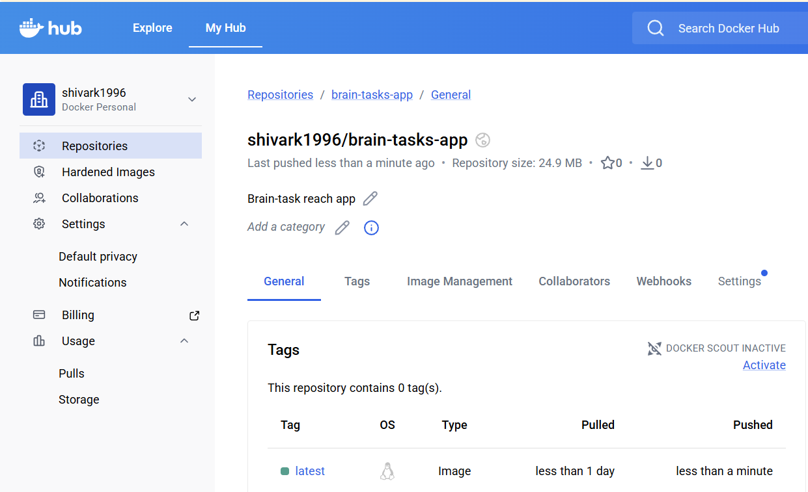
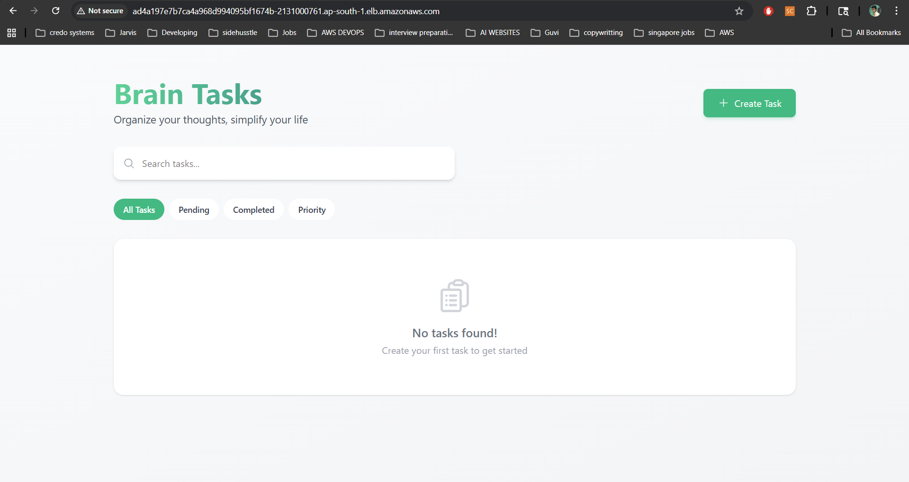

## DevOps Practice Project – Dist Directory
This repository contains the production-ready build files (dist folder) for DevOps practice and deployment exercises.It is intentionally structured to help learners focus on CI/CD pipelines, hosting, containerization, and infrastructure setup rather than application development.

## 📁 What This Repository Contains
- dist/ – Compiled and production-ready static files
- HTML
- CSS
- JavaScript
- Assets (images, fonts, etc.)

These files are ready to deploy to:
- Web servers (Nginx / Apache)
- Cloud platforms (AWS S3, Azure Blob, GCP Storage)
- Containerized environments (Docker + Nginx)
- Kubernetes clusters

# Brain Tasks Application

A web application containerized with Docker, deployed on AWS EKS (Elastic Kubernetes Service) with a fully automated CI/CD pipeline using AWS CodePipeline and CodeBuild.

## 🚀 Architecture Overview

GitHub Repository → CodePipeline → CodeBuild → Docker Hub → AWS EKS → LoadBalancer


## 📋 What I Accomplished

### ✅ Application Deployment
- Containerized a web application using Docker
- Application runs on port 3000
- Docker image stored on Docker Hub: `shivark1996/brain-tasks-app:latest`

### 🐳 Docker Hub Repository



### ✅ AWS Infrastructure
- **EKS Cluster**: Created and configured Kubernetes cluster (`brain-cluster`)
- **EC2 Instance**: Used for cluster management and kubectl commands
- **LoadBalancer**: Application exposed via AWS LoadBalancer with external access

### 🖥️ Application Running


### ✅ CI/CD Pipeline (AWS CodePipeline)
- **Source Stage**: Connected to GitHub repository (Brain-Tasks-App)
- **Build Stage**: AWS CodeBuild with custom `buildspec.yml`
- **Deploy Stage**: Automatic deployment to EKS cluster


### ✅ Kubernetes Configuration
- **Deployment**: 2 replicas for high availability
- **Service**: LoadBalancer type for external access
- **Health Checks**: Readiness and liveness probes configured

### ✅ Monitoring
- **CloudWatch Logs**: All build and deployment logs are tracked
- **CodeBuild Logs**: Real-time build output in `/aws/codebuild/brain-tasks-build`
- **Application Logs**: Accessible via `kubectl logs`

### ✅ Security & Permissions
- IAM roles configured for CodePipeline, CodeBuild, and EKS
- EKS access entries for service roles
- Proper RBAC configuration for cluster access


## 🛠️ Technologies Used

| Category | Technology |
|----------|------------|
| Containerization | Docker |
| Orchestration | Kubernetes (EKS) |
| CI/CD | AWS CodePipeline, CodeBuild |
| Version Control | GitHub |
| Container Registry | Docker Hub |
| Monitoring | AWS CloudWatch |
| Infrastructure | AWS (EC2, EKS, VPC, IAM) |

## 📊 Kubernetes Resources

### Deployment: `brain-app`
- **Replicas**: 2
- **Container Port**: 3000
- **Image**: `shivark1996/brain-tasks-app:latest`
- **Strategy**: Rolling update

### Service: `brain-service`
- **Type**: LoadBalancer
- **Port Mapping**: 80 → 3000
- **External Access**: Yes


### Check deployment status
```bash
kubectl get pods
kubectl get svc
kubectl get deployments
```
## 📚 Documentation

For complete step-by-step documentation of what I accomplished, please refer to:
- **[Application Deployment.pdf](./docs/Application%20deployment.Pdf)** - Complete manual and implementation guide.
